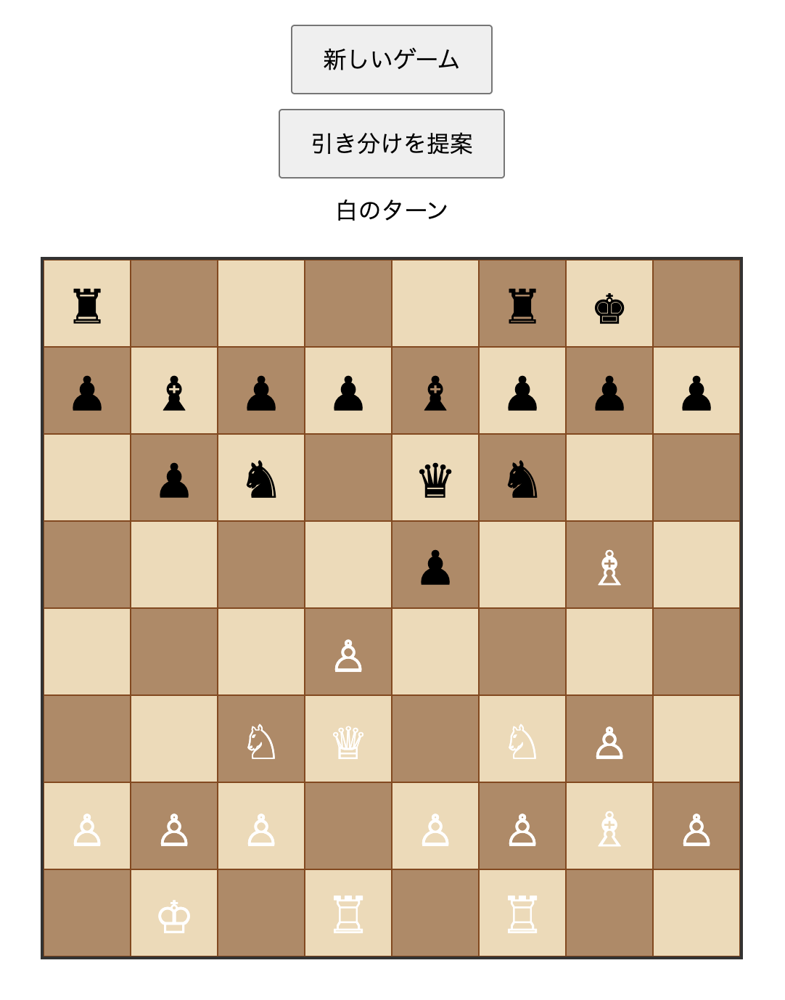

# ♜ シンプルなチェスゲーム

ブラウザで動作するシンプルなチェスゲームです。HTML、CSS、JavaScriptのみで構築されています。



## ✨ 主な機能
- 基本的な駒の動き
- キャスリング（キングの特殊な動き）
- アンパッサン（ポーンの特殊な捕獲方法）
- ポーンのプロモーション
- 引き分け
  - スリーフォールド・レピティション（同じ盤面が3回出現）
  - 50手ルール
  - 不十分な駒（チェックメイトが不可能な状況）
  - ステイルメイト
  - 引き分けの提案と受諾/拒否

## 🚀 ライブデモ
[GitHub Pages](https://miya123123.github.io/SimpleChessGame)

## 🛠 ローカル環境での実行方法
```bash
git clone https://github.com/miya123123/SimpleChessGame.git
cd SimpleChessGame
# 任意のWebサーバーで起動（例: Python3の場合）
python3 -m http.server 8000
# ブラウザで http://localhost:8000 にアクセス
```

## 🎮 操作方法
- **駒の移動**: 駒をクリックして移動先をクリックします
- **新しいゲーム**: 「新しいゲーム」ボタンをクリックします
- **引き分けの提案**: 「引き分けを提案」ボタンをクリックします
- **ポーンのプロモーション**: ポーンが相手の陣地の最奥に到達すると、自動的にプロモーション選択画面が表示されます

## 👨‍💻 各ソースコードの役割
- index.html        # メインのHTMLファイル
- style.css         # スタイルシート
- main.js           # アプリケーションのエントリーポイント
- ChessGame.js      # メインのゲームクラス
- BoardSetup.js     # ボードの初期化と設定
- PieceMovement.js  # 駒の移動とバリデーションロジック
- GameState.js      # ゲーム状態の管理
- Promotion.js      # ポーンのプロモーション処理
- Utils.js          # ユーティリティ関数

## 🛠 作者

miya_gamedev (@miya123123)

## 📜 ライセンス

[MIT License](LICENSE)

## 🤝 貢献方法

IssueやPull Requestを歓迎します。
コントリビューションガイドラインは特に設けていません。

## 🤖 使用LLM

「Claude 3.7 Sonnet」をソースコードとREADME.mdの生成に使用しました。

